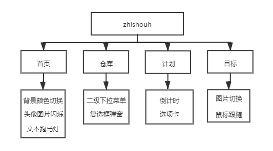

### JavaScript期末作品

#### 主题：山寨版GitHub

#### 结构：

#### 

#### 特效说明：

##### 1.背景颜色切换

```JavaScript
// 定义两个背景颜色变量
var color1 = "#fff"
var color2 = "#000"

// 获取按钮edit的id-为了更改按钮的背景颜色
var edit = document.getElementById('edit')

function changeColor(index) {
  // 改变背景颜色
  document.body.style.backgroundColor = index
  // 改变按钮edit的颜色
  if (index == color1) {
    edit.style.backgroundColor = "#F5F5F5"
  } else {
    edit.style.backgroundColor = "#000"
  }
} 
```

##### 2.头像图片闪烁

```JavaScript
// 定义blink函数
function blink() {
  // 获取图片id
  var BigAvatar = document.getElementById("BigAvatar")
  // 条件判断
  if (BigAvatar.style.display == "none") {
    BigAvatar.style.display = "block"
  } else {
    BigAvatar.style.display = "none"
  }
}
// 定义定时器
setInterval("blink()", 600)
```

##### 3.文本跑马灯颜色走动

```javascript
// 获取元素节点的文本
var text = document.getElementById('text').innerText
var i = 0
var speed = 10
function changColor() {
  var str = text.substring(0, i)
  str += "<font color = 'red'>" + text.charAt(i) + "</font>"
  str += text.substring(i + 1, text.length)
  if (i++ == text.length) {
    i = 0
  }
  document.getElementById('text').innerHTML = str
}

// 定义定时器
setInterval('changColor()', 1000 / speed)
```

##### 4.二级下拉菜单

```javascript
// 展示
function show(obj) {
  var menu = obj.getElementsByTagName("ul")
  menu[0].style.display = "block"
}

// 隐藏
function hide(obj) {
  var menu = obj.getElementsByTagName("ul")
  menu[0].style.display = "none"
}
```

##### 5.复选框弹窗

```JavaScript
// 获取复选框的id
var star1 = document.getElementById("star1")
star1.onclick = function () {
  if (star1.checked) {
    alert("确定为Vue.js这个仓库点赞吗?")
  } else {
    alert("取消为Vue.js这个仓库点赞吗?")
  }
}
```

##### 6.倒计时

```JavaScript
// 获取p段落id
var now = document.getElementById("now");
var countdown = document.getElementById("countdown")

// 补位函数
function fill(i) {
  if (i < 10) {
    return "0" + i;
  }
  return i;
}

// 定义当前时间函数
function nowTime() {
  setTimeout("nowTime()", 1000)
  var nowtime = new Date;
  var year = nowtime.getFullYear()
  var month = nowtime.getMonth() + 1;
  var date = nowtime.getDate()
  var day = nowtime.getDay();
  var week = ["星期日", "星期一", "星期二", "星期三", "星期四", "星期五", "星期六"]
  var hours = fill(nowtime.getHours());
  var min = fill(nowtime.getMinutes());
  var sec = fill(nowtime.getSeconds())
  now.innerHTML = year + "年" + month + "月" + date + "日" + "&nbsp&nbsp&nbsp" + week[day] + "&nbsp&nbsp&nbsp" + hours + "时" + min + "分" + sec + "秒"
}
setTimeout("nowTime()", 0)

// 定义倒计时函数
function Countdown() {
  setTimeout("Countdown()", 1000)
  var nowtime = new Date();
  var plan = new Date("2021/12/31")
  var lefttime = plan - nowtime;
  var day = Math.floor(lefttime / (1000 * 60 * 60 * 24))
  var hours = Math.floor(lefttime / (1000 * 60 * 60) % 24)
  var min = Math.floor(lefttime / (1000 * 60) % 60)
  var sec = Math.floor(lefttime / (1000) % 60)
  countdown.innerHTML = "距离2021/12/31" + "&nbsp&nbsp&nbsp" + "还剩" + day + "天" + hours + "小时" + min + "分钟" + sec + "秒"
}
setTimeout("Countdown()", 0)
```

##### 7.选项卡

```JavaScript
// 获取节点
var tabList = document.getElementById("tab-list")  // 获取tab-list
var aLis = tabList.getElementsByTagName("li")  // 获取tab-list下的li
var tDiv = document.getElementById("tDiv")  // 获取选项卡的id
var contents = tDiv.getElementsByTagName("div")  // 获取选项卡下面的子div

// 循环tab-list下的三个li
for (var i = 0; i < aLis.length; i++) {
  aLis[i].index = i
  aLis[i].onclick = function () {
    for (var j = 0; j < aLis.length; j++) {
      aLis[j].className = ''
    }
    this.className = "tab-active"

    for (var j = 0; j < contents.length; j++) {
      contents[j].className = "tab-content tab-content-hide"
    }
    contents[this.index].className = "tab-content tab-content-show"
  }
}
```

##### 8.图片切换

```JavaScript
// 获取四个按钮节点
var pre = document.getElementById("pre")
var next = document.getElementById("next")
var start = document.getElementById("start")
var stop = document.getElementById("stop")

// 获取图片节点
var carouselPic = document.getElementById("carouselPic")

// 定义数组存放图片
var imgArr = ["images/lb (1).jpg", "images/lb (2).jpg", "images/lb (3).jpg", "images/lb (4).jpg", "images/lb (5).jpg","images/lb (6).jpg", "images/lb (7).jpg", "images/lb (8).jpg", "images/lb (9).jpg"]
var index = 0
var timer

// 上一张
pre.onclick = function () {
  index--
  if (index < 0) {
    index = imgArr.length - 1
  }
  carouselPic.src = imgArr[index]
}

// 下一张
next.onclick = function () {
  index++
  if (index > imgArr.length - 1) {
    index = 0
  }
  carouselPic.src = imgArr[index]
}

// 自动切换
start.onclick = function () {
  clearInterval(timer)
  timer = setInterval(function () {
    index++
    if (index > imgArr.length - 1) {
      index = 0
    }
    carouselPic.src = imgArr[index]
  }, 2000)
}

// 暂停切换
stop.onclick = function () {
  clearInterval(timer)
}
```

##### 9.鼠标跟随

```javascript
// 获取节点id
var box = document.getElementById("box");
//绑定鼠标移动事件
document.onmousemove = function (event) {
  /*获取到鼠标的坐标 */
  var left = event.clientX;
  var top = event.clientY;
  //设置div的偏移量
  box.style.left = left + (-20) + "px";
  box.style.top = top + (-20) + "px";
}
```

